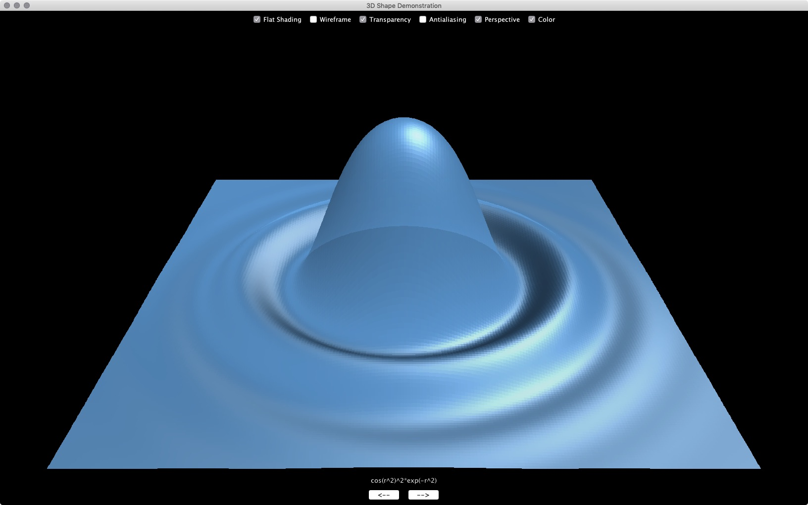

### Description
The artifact I selected for algorithms and data structures is a Java program that I wrote during my free time while studying at SNHU. The program draws 15 different 3D objects by transforming vertex points to screen space using matrix rotations and projections. After transformation, the points are drawn using the Java Graphics2D drawPoly() method. The user can rotate each object by clicking on the screen or by using the arrow keys. The user can also switch between objects using the tab key. Various other options like antialiasing can be enabled with other keys.

### Why I selected this item
I selected this artifact to include in my ePortfolio because it a great example of how various data structures and algorithms can be used in concert to achieve a specific task. The program utilizes data structures like vectors, matrices, and nodes for various operations. Vectors are used to hold the x, y, and z coordinates of each vertex, matrices are used for rotation operations, and notes are used for storing polygon definitions in a binary search tree. To generate the screen space coordinates and shading for each polygon, a wide variety of algorithms were used. I started by creating basic algorithms for matrix-vector multiplication using nested loops to compute the resulting elements of the transformed vector. I also added basic operations like vector addition, subtraction, dot product, cross product, etc. With these operations, higher-order methods could be constructed to compute the color of each polygon based on the angle between the face normal and the light source. This approach to lighting is called diffuse shading. To create specular highlights, I needed to compute the reflection direction of the light source based on the surface normal of a face, the light source direction, and the viewing direction (Figure 2). All together, these operations demonstrate a wide variety of algorithms and data structures.

To improve the artifact, I added a binary search tree (BST) data structure to store and sort the faces for each object so they can be drawn back to front. The advantages of using BSTs include fast searches, fast insertion, and fast deletion. Previously, I used an inefficient selection sort method with a big-O complexity of O(n^2). BSTs, however, have a complexity of O(log n) and are therefore much faster. The BST was implemented by creating a new BinaryTree.java class that contains a node data structure, a method for adding nodes to the tree, and a method for adding traversing the tree in order. Each node stores a 2D “face” array that holds the x, y, and z components for each vertex in the face. A depth value is also stored that holds the average depth of all the vertices in the face. Lastly, left and right nodes contain the left and right children of the current node.

### Course Objectives
I met and exceeded my objectives for the enhancement to the artifact. I initially intended only intended to implement a new BST sorting algorithm; however, I was also able to improve the GUI and add methods to compute specular lighting on the 3D objects. This involved implementing several new methods for vector operations and computing reflections. Regarding the outcome-coverage plans, I currently do not have any additional updates. I look forward to receiving instructor feedback on the project so I can make additional improvements if necessary. When I have time, I intend to put of the vector methods in a separate class to make the program more modular.

### Process of enhancing and/or modifying the artifact
While implementing the BST class in the artifact, I learned several key facts. The approach I used previously to create a BST in C++ utilized pointers to child nodes. Java does not have pointers, instead objects are accessed through references to their instances.Additional differences include the way in which nodes are accessed. For example, in Java, nodes are accessed using dot notation like node.left or node.right. In C++, the nodes are accessed using arrow notation like node->left or node->right because each child node is a pointer to an object. Also, the pointer this allows an object to access its own address for example in recursive calls. These differences made the Java implementation easier implement. While switching between C++ and Java can be challenging, I found the process to be helpful for furthering my understanding of both languages.
